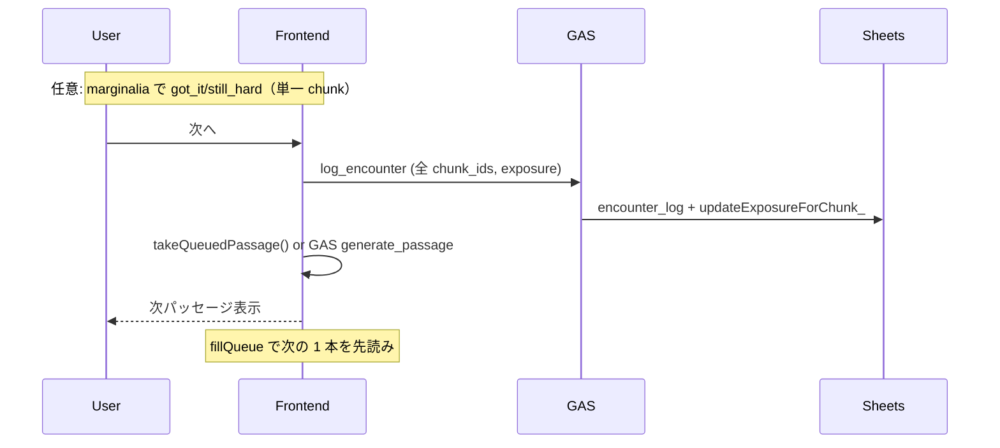

# チャンク提案・遭遇・管理 — 設計書（Claude レビュー用）

> **最終更新:** 2026-06-22  
> **関連:** [product-overview.md](./product-overview.md) · [claude-api.md](./claude-api.md) · [setup.md](./setup.md)

---

## 0. レビュー依頼

1. **個別評価 + exposure 分離** — 卒業の質と文脈露出の分離は、SLA 原理（noticing、能動的処理）と整合するか
2. **フェーズ適応選定** — 未学習率ベースの new/復習比率は「導入期に同じものばかり」問題を解くか
3. **new 上限 3 / 最大 5 チャンク** — i+1（真の +1）を維持できるか
4. **distinct カウント** — `passive` 除外、`exposure` 含む設計の妥当性
5. **卒業条件** — got_it ≥ 6 × distinct ≥ 5 は個別評価化後に適切か

---

## 1. 用語

| 用語 | 意味 |
|------|------|
| **チャンク** | `chunks_master` 1 行（学習単位） |
| **パッセージ** | 4–7 文・最大 5 チャンクの読み物 |
| **遭遇** | `encounter_log` に記録されるイベント |
| **exposure** | 「次へ」押下による文脈露出（distinct の主トリガー） |
| **due** | `next_due_at ≤ now` のチャンク |
| **maintenance** | due が空のとき、24h 以上未遭遇チャンクをローテーション |

---

## 2. 遭遇の記録（3 軸分離）

### 2.1 フロントエンド → GAS

| ユーザー操作 | API | chunk 対象 | signal |
|-------------|-----|-----------|--------|
| marginalia「✓ OK」 | `log_encounter` | **単一** `chunk_id` | `got_it` |
| marginalia「△ 保留」 | `log_encounter` | **単一** `chunk_id` | `still_hard` |
| Footer「次へ →」 | `log_encounter` | **全** `chunk_ids` | `exposure` |
| 60 秒タイマー切れ | — | — | **送信しない** |
| スワイプで戻る | — | — | 記録なし |

評価は任意。「次へ」だけでパッセージは進める。

### 2.2 GAS progress 更新

```
handleLogEncounter_(body)
  ├─ encounter_log に全行 append
  ├─ signal === got_it | still_hard
  │     → updateProgressForChunk_()  … stage, got_it/still_hard, encounter_count, distinct 再計算
  └─ signal === exposure
        → updateExposureForChunk_()   … distinct_passages_count, last_encountered_at のみ
```

`passive` / `skipped`: ログのみ、progress 更新なし。

### 2.3 distinct_passages のカウント

`countDistinctPassagesForChunk_()`:

- 対象 signal: `got_it`, `still_hard`, `exposure`
- **除外:** `passive`, `skipped`
- 同一 `passage_id` は 1 回のみカウント

通常フロー: チャンクごとに OK/保留（任意）→「次へ」で exposure。exposure が distinct の主な増分源。

### 2.4 評価済みチャンクの UI

- `chunkEvaluations: { [chunkId]: 'got_it' | 'still_hard' }`（パッセージ内 state）
- ハイライト色: `chunk--evaluated-ok` / `chunk--evaluated-hold`
- marginalia で二重評価不可

---

## 3. SRS

### 3.1 ステージ間隔 (`SRS_INTERVAL_DAYS`)

| stage | 間隔 | status 目安 |
|-------|------|------------|
| 0 | 0 | new |
| 1 | +1 日 | learning |
| 2 | +3 日 | learning |
| 3 | +7 日 | learning |
| 4 | +14 日 | reviewing |
| 5 | +30 日 | reviewing / graduated |

### 3.2 シグナルと stage

| signal | stage 変化 | next_due_at |
|--------|-----------|-------------|
| `got_it` | +1（最大 5） | 新 stage の間隔 |
| `still_hard` | −1（最小 0） | 新 stage の間隔 |
| `exposure` | 変化なし | 変化なし |

`applySignalToStage_` は `got_it` / `still_hard` のみ処理。`passive` の due 延長ロジックは残存するが、フロントから passive は送られない。

### 3.3 卒業 (`shouldGraduate_`)

| 条件 | 閾値 |
|------|------|
| `got_it_count` | ≥ 6 |
| `distinct_passages_count` | ≥ 5 |
| 初回遭遇からの日数 | ≥ 3 |
| `still_hard_count / got_it_count` | < 0.3 |

卒業時: `status = graduated`, `srs_stage = 5`, `next_due_at = 今日 + 30 日`。

**個別評価化の効果:** 以前は「次へ」一括 got_it で全チャンクが同時に卒業カウントされていた。現行は **OK を押したチャンクのみ** `got_it_count` が増える。

---

## 4. チャンク選定 (`selectChunksForPassage_`)

### 4.1 フェーズ判定

```javascript
未学習率 = (status===new || srs_stage===0) / バンド内チャンク総数
```

| フェーズ | 未学習率 | newCount | reviewCount |
|---------|---------|----------|-------------|
| 導入期 | > 40% | 3 | 2 |
| 成長期 | 15–40% | 2 | 3 |
| 定着期 | < 15% | 1 | 4 |

- 合計最大 **5**、最低 **2**（不足時フォールバック）
- **new 上限 3**（i+1 維持）

### 4.2 復習候補の優先順位

`sortReviewCandidates_()`:

1. `still_hard_count` 降順（苦手優先）
2. `distinct_passages_count` 昇順（露出が少ない）
3. `srs_stage` 昇順（定着が浅い）

### 4.3 due リスト (`handleDueChunks_`)

1. progress なし → `new_chunks`
2. `next_due_at ≤ now` → `due_chunks`（shuffle）
3. due 0 件 → maintenance（24h+ 未遭遇を最古順 + shuffle）

### 4.4 フォールバック

候補不足時: due 補充 → new 補充 → 固定テンプレ `chunk_texts`

---

## 5. パッセージ供給パイプライン

```
buildPassageForUser_()
  ├─ handleDueChunks_()
  ├─ selectChunksForPassage_()     … フェーズ適応・最大 5
  ├─ findCachedPassage_()          … 完全一致
  ├─ findCachedPassageContainingChunks_() … スーパーセット
  ├─ pickTemplateCoveringChunks_()
  ├─ needsNewPassageContext_() ?
  │     true  → generateDynamicPassageClaude_()  … Sonnet（最大 2 試行）
  │     false → pickTemplatePassage_()
  └─ buildPassageOutput_()
```

**`needsNewPassageContext_`:** 選定チャンクのいずれかが new / stage 0 / `distinct_passages_count < 3`。

---

## 6. フロントエンド提示タイミング

| イベント | 動作 |
|---------|------|
| 起動 / CEFR 切替 | `GET /session` → 1 本目 |
| 「次へ」 | exposure 送信 → advance |
| 先読み | 読書中に次 1 本を GAS で生成 |
| GAS 遅延 | ローカル `passage-templates.json` fallback |

**次パッセージ取得順** (`acquireNextPassageIndex`):

1. 先読みキュー（即時）
2. in-flight prefetch 待ち（最大 ~4 秒）
3. GAS `generate_passage`
4. ローカルテンプレ

「次へ」時に `clearPrefetch()` は**呼ばない**（先読み 1 本をそのまま使用）。

---

## 7. データ配置

### 7.1 Sheets

**`encounter_log`**

| 列 | 内容 |
|----|------|
| event_id | UUID |
| user_id, chunk_id, passage_id | |
| read_at | ISO 8601 |
| signal | got_it / still_hard / exposure / passive / skipped |
| time_on_page_ms | |

**`user_progress`** — §3 参照

**`chunks_master`** — `enrich_version` 列あり（差分 enrich）

### 7.2 Drive

| パス | 内容 |
|------|------|
| `passages/*.json` | Sonnet 生成本体 |
| `shared/passage-templates.json` | 45 固定テンプレ |

---

## 8. シーケンス（「次へ」）



---

## 9. 参照コード

| 責務 | ファイル | 関数 |
|------|---------|------|
| フェーズ選定 | `gas/Code.gs` | `computeUnlearnedRatio_`, `passageMixForPhase_`, `selectChunksForPassage_` |
| exposure | `gas/Code.gs` | `updateExposureForChunk_`, `handleLogEncounter_` |
| 個別評価 | `gas/Code.gs` | `updateProgressForChunk_` |
| distinct | `gas/Code.gs` | `countDistinctPassagesForChunk_` |
| フロント評価 | `src/hooks/useReader.js` | `evaluateChunk`, `recordExposure`, `handleNext` |
| 先読み | `src/hooks/usePassagePrefetch.js` | `PREFETCH_QUEUE_SIZE=1` |
| advance | `src/lib/passageList.js` | `acquireNextPassageIndex` |

---

## 10. スコープ外（後続）

| 項目 | 備考 |
|------|------|
| Cloze → got_it 連動 | marginalia 基盤が整った後 |
| 忘却予測 due | データ蓄積後 |
| 進捗ダッシュボード | Phase 6 |

---

*Claude 設計レビュー用。実装: コミット `5750e20` 以降*
