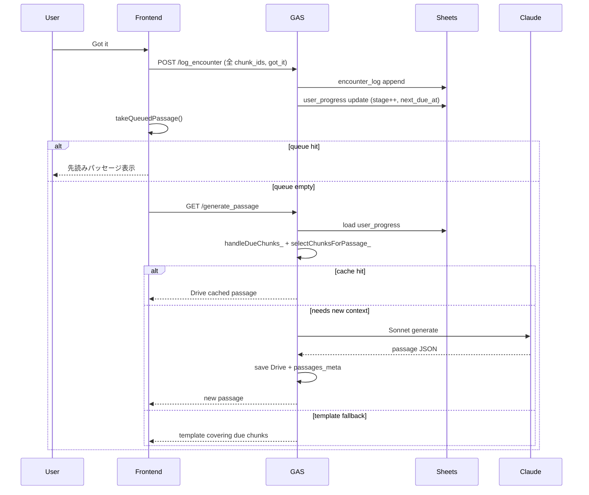
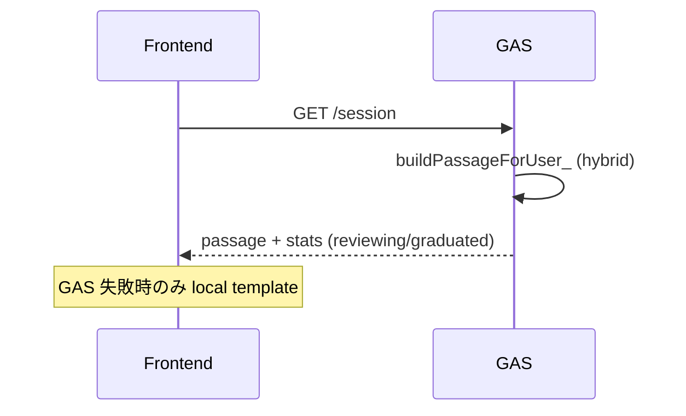

# チャンク提案・生成・管理 — 設計書（Claude レビュー用）

本ドキュメントは **English Reader Trainer** において、学習チャンクを **いつ・どこで・どのように** ユーザーに提案するか、AI 生成を **どこで実行し** 成果物を **どこで管理するか** を整理したものです。

**関連:** [product-overview.md](./product-overview.md) · [claude-api.md](./claude-api.md) · [setup.md](./setup.md)

**最終更新:** 2026-06-21

---

## 0. レビュー依頼（Claude 向け）

以下について設計レビューをお願いします。

1. **SRS 間隔と「固定感」** — ステージ 5 / graduated 後 30 日間隔と、maintenance ローテーション（24h 以上未遭遇）のバランスは妥当か
2. **チャンク選定 → パッセージ生成の責務分離** — GAS 内の `handleDueChunks_` / `selectChunksForPassage_` / `buildPassageForUser_` の分割は適切か
3. **AI 生成タイミング** — リアルタイム Sonnet vs バックグラウンド warmup + critique の二経路は過剰か不足か
4. **データの単一ソース** — Sheets / Drive / リポジトリ同梱 JSON の 3 層キャッシュの整合性リスク
5. **卒業条件** — encounter ≥ 5 × distinct_passages ≥ 3 × still_hard 率 < 30% は早すぎるか（一括 got_it で全チャンク同時卒業しうる）

---

## 1. 用語と全体像

| 用語 | 意味 |
|------|------|
| **チャンク** | 語彙・句動詞・コロケーション等の学習単位（`chunks_master` 1 行） |
| **パッセージ** | 3〜6 文・2〜4 チャンクを含む読み物（1 回の「ページ」） |
| **遭遇 (encounter)** | ユーザーがパッセージを読み、シグナル（got_it / still_hard / passive）を記録したイベント |
| **due（期限到来）** | `next_due_at ≤ now` のチャンク。SRS により再提示対象 |
| **maintenance（保守ローテ）** | 正式 due が空のとき、最終遭遇から 24h 以上経過したチャンクをローテーション提示 |

### 1.1 設計思想（要約）

> **異なる文脈で、間隔をあけて、多数回チャンクに出会わせ、チャンク知識を自動化する。**

- 正答率ではなく **異なる passage_id での遭遇回数** で卒業を判定
- 翻訳は本文タップ時のみ（常時和訳なし）
- 低摩擦 UX（セッション終了なし・即 advance）

---

## 2. チャンクがユーザーに提案されるタイミング

### 2.1 SRS ステージと再会間隔

`gas/Code.gs` の `SRS_INTERVAL_DAYS`:

| srs_stage | 次回 due までの日数 | ステータス目安 |
|-----------|-------------------|---------------|
| 0 | 0（即座） | new |
| 1 | +1 日 | learning |
| 2 | +3 日 | learning |
| 3 | +7 日 | learning |
| 4 | +14 日 | reviewing |
| 5 | +30 日 | reviewing / graduated |

**シグナル:**

| シグナル | ステージ変化 | next_due_at |
|---------|-------------|-------------|
| `got_it` | +1（最大 5） | 新ステージの間隔で再計算 |
| `still_hard` | −1（最小 0） | 新ステージの間隔で再計算 |
| `passive`（30s タイマー） | 変化なし | 今日 +1 日 |
| `skipped` | 変化なし | 既存値を維持 |

**卒業条件** (`shouldGraduate_`):

- `encounter_count ≥ 5`
- `distinct_passages_count ≥ 3`（異なる passage_id）
- `still_hard_count / encounter_count < 0.3`

卒業時: `status = graduated`, `srs_stage = 5`, `next_due_at = 今日 + 30 日`

### 2.2 1 パッセージあたりのチャンク選定 (`selectChunksForPassage_`)

GAS が 1 本のパッセージに載せる 2〜4 チャンクを決める優先順位:

```
1. new チャンク 1 個（i+1 ガード: 最大 2 new / パッセージ）
2. due かつ learning（stage 1–3）最大 2 個
3. due かつ reviewing（stage 4+）最大 1 個
4. 不足時: due から backfill
5. 不足時: new 2 個目
6. 不足時: ランダム固定テンプレの chunk_texts（最終手段）
```

**due リストの構築** (`handleDueChunks_`):

1. バンド内 CEFR スコープの全チャンクを走査
2. progress なし → `new_chunks`
3. `next_due_at ≤ now` → `due_chunks`（still_hard 多い順 → shuffle）
4. due が 0 件 → **maintenance**: 最終遭遇から 24h 以上経過したチャンクを最古順 + shuffle で補充

### 2.3 フロントエンドでの提示タイミング

| イベント | 動作 |
|---------|------|
| アプリ起動 / CEFR 切替 | `GET /session` → GAS が 1 本目を SRS ベースで選定 |
| 「理解した」/ 「まだむずかしい」 | 全 passage チャンクに同一シグナルで encounter 記録 → 次パッセージ advance |
| 30s 読了タイマー | 全チャンクに `passive` 記録 |
| スワイプ / 矢印 advance | encounter **記録なし**（SRS 更新なし） |
| Cloze (~30%) | 現在パッセージ内の 1 チャンクをランダム空白 |

**次パッセージ取得順** (`acquireNextPassageIndex`):

```
1. 先読みキュー（GAS /generate_passage で事前取得済み）
2. ネットワーク prefetch / remote（GAS hybrid — SRS 駆動）
3. ローカル passage-templates.json（GAS 不通時の fallback のみ）
```

---

## 3. AI 生成 — どこで・いつ・何を作るか

### 3.1 生成タスク一覧

| タスク | モデル | 実行場所 | タイミング | 出力先 |
|--------|--------|---------|-----------|--------|
| パッセージ本文生成 | Sonnet 4.6 | GAS `callClaudeGeneratePassage_` | hybrid: `needsNewPassageContext_` が true のときリアルタイム | Drive `passages/*.json` + `passages_meta` |
| パッセージ critique | Haiku 4.5 | GAS `critiquePassage_` | warmup / batch のみ（ユーザー待ちなし） | `passages_meta.critique_verdict` |
| ja 和訳 enrich | Haiku 4.5 | GAS `enrichAllTranslations` | 手動バッチ | `chunks_master.ja_translation` |
| en グロス enrich | Haiku 4.5 | GAS `enrichAllEnglishGlosses` | 手動バッチ | `chunks_master.en_translation` |
| 固定テンプレ 45 本 | Sonnet 4.6 | GAS `generateTemplateBatch_` | 手動 / 計画 | Drive + `shared/passage-templates.json` |

### 3.2 パッセージ生成パイプライン（hybrid モード — デフォルト）

```
buildPassageForUser_()
  │
  ├─ handleDueChunks_()           … due / new / maintenance チャンク
  ├─ selectChunksForPassage_()    … 2–4 チャンク確定
  │
  ├─ findCachedPassage_()         … Drive キャッシュ（critique pass 優先）
  ├─ pickTemplateCoveringChunks_()… due チャンクをカバーする固定テンプレ
  │
  ├─ needsNewPassageContext_() ?
  │     true  → generateDynamicPassageClaude_()  … Sonnet リアルタイム
  │     false → pickTemplatePassage_()           … ランダムテンプレ
  │
  └─ enrichPassageTemplate_ / buildPassageOutput_ … marginalia 用メタ付与
```

**`needsNewPassageContext_` が true になる条件:**

- 選定チャンクのいずれかが new / stage 0
- または `distinct_passages_count < 3`（まだ 3 文脈未満）

→ **「異なる文脈での再会」** を担保するため、文脈が足りないチャンクには新規 Sonnet 生成を試みる。

### 3.3 生成プロンプトに注入するコンテキスト

| 注入データ | 取得元 | 目的 |
|-----------|--------|------|
| `intended meaning` | `chunks_master.ja_translation` | コア意味の固定 |
| `prior_contexts` | `encounter_log` + Drive passages | 過去 3 文脈を避けて新文脈を生成 |
| CEFR バンド制約 | `normalizeCefrBand_` | i+1 語彙レベル |
| `self_check` | Sonnet 出力必須 | regex 検証前の自己申告 |

詳細プロンプト全文: [claude-api.md](./claude-api.md)

### 3.4 バックグラウンド生成（ユーザー非同期）

| 関数 | 用途 |
|------|------|
| `warmupPassagesForBand_()` | critique 合格品を事前に Drive へ蓄積 |
| `generatePassageWithCritique_()` | 生成 → critique → pass のみ保存 |
| `generateTemplateBatch_()` | 固定 45 テンプレの Sonnet 差し替え |

---

## 4. データ管理 — どこに何を置くか

### 4.1 レイヤー図

```
┌─────────────────────────────────────────────────────────────┐
│ ブラウザ (GitHub Pages)                                      │
│  shared/passage-templates.json  … 45 本・オフライン fallback │
│  chunkGlosses.js               … ja/en ローカルキャッシュ    │
└──────────────────────────┬──────────────────────────────────┘
                           │ fetch /session, /generate_passage,
                           │       /log_encounter, /stats
┌──────────────────────────▼──────────────────────────────────┐
│ Google Apps Script (Code.gs)                                   │
│  handleDueChunks_ / buildPassageForUser_ / updateProgress_    │
└───────┬──────────────────────────────┬────────────────────────┘
        │                              │
┌───────▼──────────┐          ┌────────▼─────────┐
│ Google Sheets    │          │ Google Drive      │
│ chunks_master    │          │ passages/*.json   │
│ user_progress    │          │ shared/cefr_*.json│
│ encounter_log    │          │ shared/passage-   │
│ passages_meta    │          │   templates.json  │
└──────────────────┘          └──────────────────┘
        │
┌───────▼──────────┐
│ Claude API       │
│ Sonnet / Haiku   │
└──────────────────┘
```

### 4.2 Sheets スキーマ

**`chunks_master`** — チャンクマスタ（7,125 件）

| 列 | 内容 |
|----|------|
| chunk_id | `ch_<hash>` |
| text | 英語チャンク本文 |
| cefr | A1–B2 |
| ja_translation | Haiku enrich |
| en_translation | Haiku enrich（L2 グロス） |
| example_sentence | 例文 |

**`user_progress`** — ユーザー × チャンクの SRS 状態

| 列 | 内容 |
|----|------|
| user_id | 例: `naoya` |
| chunk_id | FK |
| encounter_count | 累計遭遇 |
| distinct_passages_count | 異なる passage_id 数 |
| last_encountered_at | ISO 8601 |
| next_due_at | ISO 8601 |
| srs_stage | 0–5 |
| status | new / learning / reviewing / graduated |
| got_it_count, still_hard_count | シグナル集計 |

**`encounter_log`** — イベントログ（再計算のソース）

| 列 | 内容 |
|----|------|
| encounter_id | UUID |
| user_id, chunk_id, passage_id | |
| read_at | ISO 8601 |
| signal | got_it / still_hard / passive / skipped |
| time_on_page_ms | |

**`passages_meta`** — 生成パッセージ索引

| 列 | 内容 |
|----|------|
| passage_id | |
| target_chunk_ids | カンマ区切り（キャッシュキー） |
| drive_file_id | Drive JSON へのポインタ |
| critique_verdict | pass / revise / 空 |
| generated_at | |

### 4.3 Drive 配置

| パス | 内容 |
|------|------|
| `passages/{passage_id}.json` | Sonnet 生成パッセージ本体 |
| `shared/passage-templates.json` | 45 固定テンプレ（GAS + リポ同期） |
| `shared/cefr_a1.json` 等 | CEFR 語彙ソース |

### 4.4 フロント同梱 vs サーバー

| データ | 正 | フロントの役割 |
|--------|-----|--------------|
| SRS 状態 | Sheets `user_progress` | 表示用 stage/status は GAS 応答の `target_chunks` 経由 |
| パッセージ本文 | GAS 生成 / Drive キャッシュ | 先読みキュー経由で受信 |
| 固定テンプレ | Drive + リポ同梱 | **GAS 不通時のみ** fallback |
| チャンク gloss | Sheets → GAS → フロント | `chunkGlosses.js` にローカルミラー |

---

## 5. 既知のギャップと 2026-06-21 改修

### 5.1 問題: 「出題が固定される」

**原因（調査結果）:**

1. フロントが **ローカルテンプレを GAS より先** に選んでいた → 45 本の固定 `chunk_texts` プールを巡回
2. GAS デフォルトが `template` モードだった → SRS 未使用
3. 全チャンク graduated → 正式 due が空 → テンプレ `[0]` 固定 backfill
4. 1 回の got_it で **パッセージ内全チャンク** に同一シグナル → 一括卒業

**改修（本 PR）:**

| 変更 | ファイル |
|------|---------|
| 取得順: 先読み → GAS → ローカル fallback | `src/lib/passageList.js` |
| GAS デフォルト hybrid | `gas/Code.gs` `getPassageMode_` |
| due 空時 maintenance ローテ（24h+） | `gas/Code.gs` `collectMaintenanceDueChunks_` |
| due リスト shuffle | `gas/Code.gs` `handleDueChunks_` |
| backfill ランダムテンプレ | `gas/Code.gs` `selectChunksForPassage_` |

### 5.2 未解決・要レビュー

| 項目 | 説明 | 提案 |
|------|------|------|
| 一括 got_it | 1 パッセージ 2–4 チャンク全て同時更新 | タップしたチャンクのみ更新？ |
| passive → 卒計上 | 30s で encounter++ するが stage は動かない | 卒業条件から passive 除外？ |
| graduated 30 日 | 仕様通りだが体感「固定」 | maintenance 7 日に短縮？ |
| ローカル stage 表示 | fallback テンプレは常に stage 0 表示 | GAS 不通時は stage 非表示？ |
| Drive キャッシュ空 | リフレッシュ後 warmup 未実行 | P2 warmup 優先 |

---

## 6. シーケンス図

### 6.1 「理解した」→ 次パッセージ



### 6.2 初回ロード



---

## 7. 運用チェックリスト

- [ ] GAS Script Property `USE_DYNAMIC_PASSAGES` = `hybrid`（または未設定で hybrid デフォルト）
- [ ] GAS Web App を最新 `Code.gs` で再デプロイ
- [ ] GitHub Pages を最新フロントでデプロイ
- [ ] `user_progress` で due 到来チャンクが存在するか確認（stage 1 → 翌日 due）
- [ ] 全 graduated 状態なら 24h 後 maintenance ローテが動くか確認
- [ ] `warmupPassagesForBand_` で Drive キャッシュ再蓄積（任意）

---

## 8. 参照コード位置

| 責務 | ファイル | 関数 |
|------|---------|------|
| SRS 間隔 | `gas/Code.gs` | `SRS_INTERVAL_DAYS`, `computeNextDueAt_` |
| due 選定 | `gas/Code.gs` | `handleDueChunks_`, `collectMaintenanceDueChunks_` |
| パッセージ用 chunk 選定 | `gas/Code.gs` | `selectChunksForPassage_` |
| パッセージ供給 | `gas/Code.gs` | `buildPassageForUser_` |
| Sonnet 生成 | `gas/Code.gs` | `generateDynamicPassageClaude_`, `callClaudeGeneratePassage_` |
| encounter 記録 | `gas/Code.gs` | `handleLogEncounter_`, `updateProgressForChunk_` |
| 先読み | `src/hooks/usePassagePrefetch.js` | `fillQueue`, `consumePrefetched` |
| advance 順序 | `src/lib/passageList.js` | `acquireNextPassageIndex` |
| ローカル fallback | `src/lib/localPassages.js` | `pickUnseenBandTemplate` |

---

*このドキュメントは Claude による設計レビュー用に作成。実装変更後は product-overview.md との整合も確認すること。*
